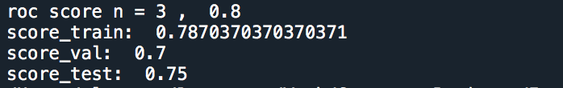
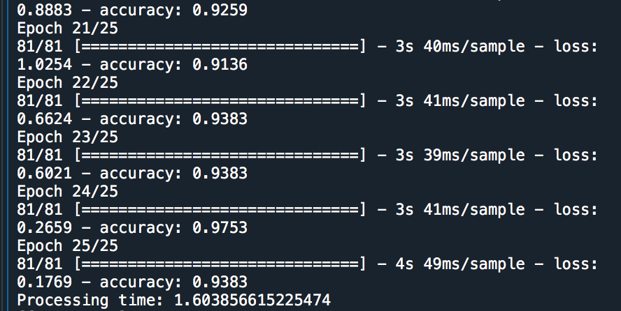

# Face-Landscape-Classifier
This project is a classification system that distinguishing pictures of faces from landscapes. First, a baseline model using KNeighbors achieves an accuracy of 75%, then a Keras Neural Network is used to achieve an accuracy of 94%.

The idea behind the system is to transform each image into a single row of data that can be fed into the model for prediction. What should this data look like? Each image consists of pixels, each with an RGB value. Therefore it is possible to plot a histogram of the R, G and B values for each image. Naturally, landscapes will skew towards higher G and B values and faces will skew towards higher R values. If you determine the central tendencies for each histogram (mean and median) then you can expect that on average landscapes will have higher means/medians for G and B, and faces will have higher mean/median for R. The goal is to use these values as the data that will be fed to the model.

All computational work is done using python.

## Image Collection and Processing
1. 100 JPG images of either faces or landscapes were collected from the web and saved to a folder.
2. Images are read into python and saved to a dataset (cnndata.csv).
3. Images are cropped to 250x250 dimensions so that images have equal values in the distribution.
4. Find the mean and median of R, G and B values for each image and append to a dataframe (imagedata.csv).
5. Label the data and save to a dataset (labels.csv).

## Modeling
1. Baseline method: K Neighbors (image_baseline.py)

3. Better method: Keras Neural Network (image_classification.py)

